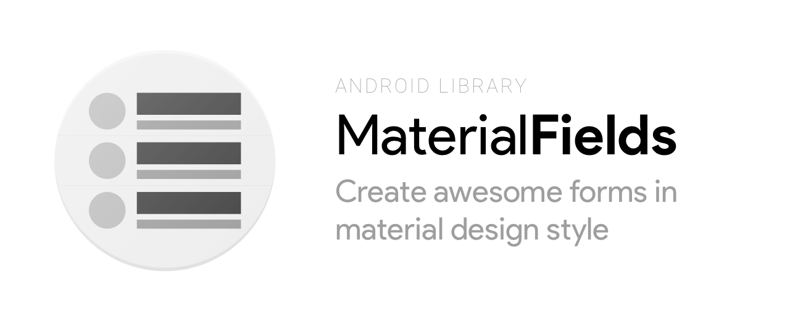

# Materialfields

[](https://gitlab.com/gabrielepmattia/materialfields/commits/production) [](https://gitlab.com/gabrielepmattia/materialfields/commits/staging)

_Create awesome forms in material design style_



# Features

The following fields are included:

- Generic one/two lines field (`fields.FieldGeneric` class)
- Text input field (`fields.FieldTextInput` class)
- Date range field (`fields.FieldDateRange` class)
- Checkbox field (`fields.FieldCheckbox` class)
- Dynamic shopping list field (`extra.ShoppingList` class)
- List field (`extra.List` class)
- Header view (`texts.Header` class)
- Simple text view (`texts.Text` class)

# Installation

Add to your `build.gradle` file

```groovy
repositories {
    maven { url "https://dl.bintray.com/gabrielepmattia/maven" }
}
```

And add the library as dependency

```groovy
compile 'com.gabrielepmattia.me:materialfields:0.0.1-beta'
```

# Examples

Here's a video showing the most relevant features of the library:

<span style="display:block;text-align:center">

</span>

The xml file for the form shown in the video is the following

```xml
<LinearLayout
    android:layout_width="match_parent"
    android:layout_height="wrap_content"
    android:orientation="vertical">

    <com.gabrielepmattia.materialfields.fields.FieldGeneric
        android:id="@+id/add_module_selector"
        android:layout_width="match_parent"
        android:layout_height="wrap_content"
        app:drawable="@drawable/cards_variant"
        app:subtitle="Module content"
        app:title="@string/module_type" />

    <com.gabrielepmattia.materialfields.texts.Header
        android:layout_width="match_parent"
        android:layout_height="wrap_content"
        app:text="Configuration" />

    <com.gabrielepmattia.materialfields.fields.FieldInputText
        android:id="@+id/add_module_survey_name"
        android:layout_width="match_parent"
        android:layout_height="wrap_content"
        app:drawable="@drawable/label"
        app:required="true"
        app:title="@string/name" />

    <com.gabrielepmattia.materialfields.fields.FieldInputText
        android:id="@+id/add_module_survey_description"
        android:layout_width="match_parent"
        android:layout_height="wrap_content"
        app:drawable="@drawable/pencil"
        app:title="@string/description" />

    <com.gabrielepmattia.materialfields.texts.Header
        android:layout_width="match_parent"
        android:layout_height="wrap_content"
        app:text="Options" />

    <com.gabrielepmattia.materialfields.extra.ShoppingList
        android:id="@+id/add_module_survey_options_shopping_list"
        android:layout_width="match_parent"
        android:layout_height="wrap_content"
        app:addItemPlaceHolder="@string/survey_add_option_placeholder" />

    <com.gabrielepmattia.materialfields.texts.Text
        android:layout_width="match_parent"
        android:layout_height="wrap_content"
        app:text="These options represent the options of the survey you can add as you want" />

    <com.gabrielepmattia.materialfields.texts.Header
        android:layout_width="match_parent"
        android:layout_height="wrap_content"
        app:text="Settings" />

    <com.gabrielepmattia.materialfields.fields.FieldDateRange
        android:id="@+id/add_module_survey_daterange"
        android:layout_width="match_parent"
        android:layout_height="wrap_content"
        app:title="@string/setting_date_limits"
        app:value="@string/setting_date_limits_description" />

    <com.gabrielepmattia.materialfields.fields.FieldCheckBox
        android:id="@+id/add_module_survey_non_admin"
        android:layout_width="match_parent"
        android:layout_height="wrap_content"
        app:title="Only admins suggest"
        app:value="Allow only the admins to suggest options" />

    <com.gabrielepmattia.materialfields.fields.FieldCheckBox
        android:id="@+id/add_module_survey_changing_mind"
        android:layout_width="match_parent"
        android:layout_height="wrap_content"
        app:title="Changing mind"
        app:value="Users can change their mind after voting an option" />

    <com.gabrielepmattia.materialfields.texts.Header
        android:layout_width="match_parent"
        android:layout_height="wrap_content"
        app:text="" />

</LinearLayout>
```

# Changelog

For the changelog please see the [Tags](/tags) section of this repository

# Contributors

Contributors are always welcomed, they will be listed here.

# License

This library is released under **LGPL-3.0** license, see `LICENSE` file for the full text.
